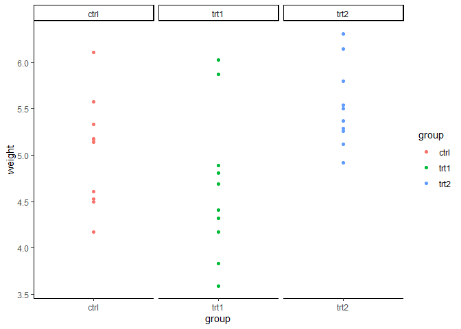

## R Markdown

### Question 4

```r
#load in and view dataset
data("PlantGrowth")
head(PlantGrowth)
```

```
##   weight group
## 1   4.17  ctrl
## 2   5.58  ctrl
## 3   5.18  ctrl
## 4   6.11  ctrl
## 5   4.50  ctrl
## 6   4.61  ctrl
```

```r
#load dependencies
library(ggplot2)
```

```
## Warning: package 'ggplot2' was built under R version 4.1.3
```

```r
#layering
ggplot(PlantGrowth, aes(x = group, y = weight)) +
  geom_point(aes(color = group))
```

<!-- -->

```r
#scales
ggplot(PlantGrowth, aes(x = group, y = weight)) +
  geom_point(aes(color = group)) +
  theme_classic() +
  facet_wrap(~group, scales = "free")
```

<!-- -->

```r
#theme
ggplot(PlantGrowth, aes(x = group, y = weight)) +
  geom_point(aes(color = group)) +
  theme_classic()
```

<!-- -->

```r
ggplot(PlantGrowth, aes(x = group, y = weight)) +
  geom_point(aes(color = group)) +
  theme_bw()
```

<!-- -->

```r
#facets
ggplot(PlantGrowth, aes(x = group, y = weight)) +
  geom_point(aes(color = group)) +
  theme_classic() +
  facet_wrap(~group, scales = "free_x")
```

<!-- -->

### Question 5

```r
#load in and view dataset
data("ToothGrowth")
head(ToothGrowth)
```

```
##    len supp dose
## 1  4.2   VC  0.5
## 2 11.5   VC  0.5
## 3  7.3   VC  0.5
## 4  5.8   VC  0.5
## 5  6.4   VC  0.5
## 6 10.0   VC  0.5
```

```r
#two ways to subset supp = VC
tooth.supp.eq.vc <- ToothGrowth[ToothGrowth$supp == "VC",]
tooth.supp.eq.vc1 <- subset(ToothGrowth, supp == "VC")

#two ways to subset supp = VC and dose = 0.5
tooth.suppvc.dose05 <- ToothGrowth[ToothGrowth$supp == "VC" & 
                                     ToothGrowth$dose == 0.5,]
tooth.suppvc.dose05.1 <- subset(ToothGrowth, supp == "VC" & dose == 0.5)

#two ways to display len values when supp = VC and dose = 0.5
tooth.supp.len <- tooth.suppvc.dose05$len
print(tooth.supp.len)
```

```
##  [1]  4.2 11.5  7.3  5.8  6.4 10.0 11.2 11.2  5.2  7.0
```

```r
tooth.supp.len1 <- tooth.suppvc.dose05.1[ , 1]
print(tooth.supp.len1)
```

```
##  [1]  4.2 11.5  7.3  5.8  6.4 10.0 11.2 11.2  5.2  7.0
```
