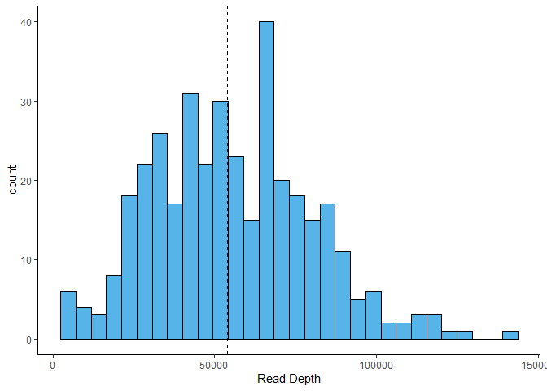
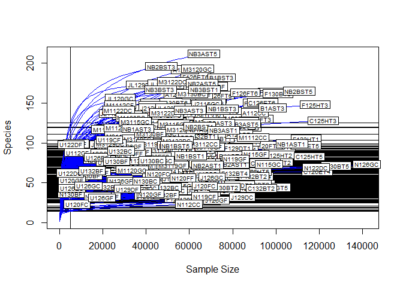
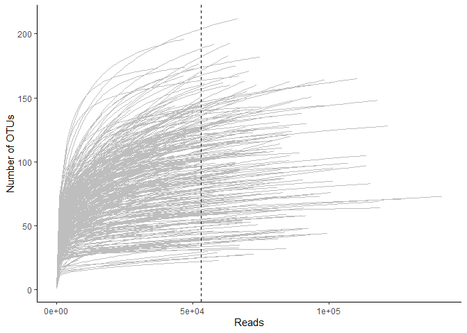
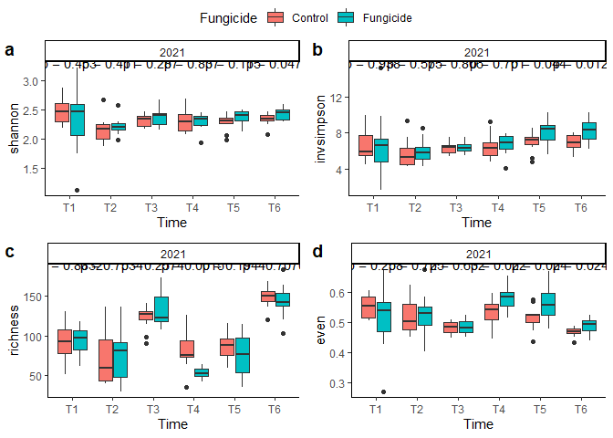
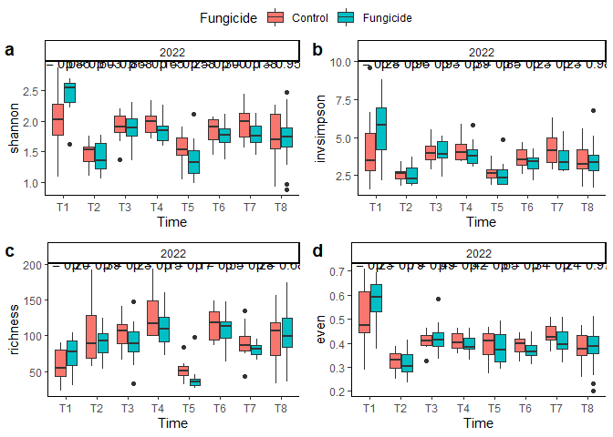
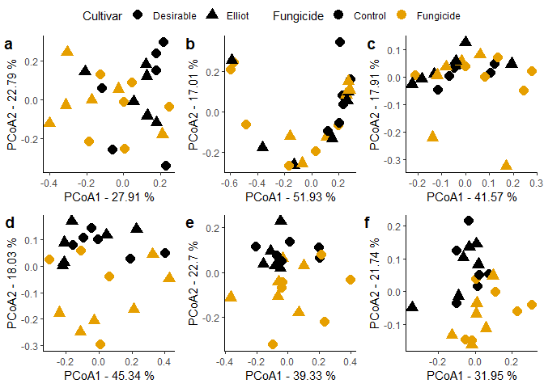

## R Markdown

## Load Dependencies

```r
library(phyloseq)
library(vegan)
library(tidyverse)
library(ggplot2)
library(Biostrings)
library(ggpubr)
library(decontam)
library(metagenomeSeq)
library(indicspecies)
```

## Colorblind Palette

```r
cbbPalette <- c("#000000", "#E69F00", "#56B4E9", "#009E73", "#F0E442", "#0072B2", "#D55E00", "#CC79A7")
```

## Load files from HPC to create a phyloseq object

```r
# Taxonomy 
#Edit the taxonomy rds
nbc.tax.fungi <- read.csv("phyloseq_input/NBC.csv")

nbc.tax.fungi <- as.data.frame(nbc.tax.fungi)
nbc.tax.fungi$OTU <- sprintf("FOTU_%s", seq(1:nrow(nbc.tax.fungi)))
rownames(nbc.tax.fungi) <- nbc.tax.fungi$OTU
nbc.tax.fungi$Kingdom <- gsub('k__','', nbc.tax.fungi$Kingdom)
nbc.tax.fungi$Phylum <- gsub('p__','', nbc.tax.fungi$Phylum)
nbc.tax.fungi$Class <- gsub('c__','', nbc.tax.fungi$Class)
nbc.tax.fungi$Order <- gsub('o__','', nbc.tax.fungi$Order)
nbc.tax.fungi$Family <- gsub('f__','', nbc.tax.fungi$Family)
nbc.tax.fungi$Genus <- gsub('g__','', nbc.tax.fungi$Genus)
nbc.tax.fungi$Species <- gsub('s__','', nbc.tax.fungi$Species)

nbc.tax.fungi <- replace(nbc.tax.fungi, is.na(nbc.tax.fungi), "unidentified")

nbc.tax.fungi$Lowest_Taxnomic_Rank <- ifelse(nbc.tax.fungi$Phylum == "unidentified", nbc.tax.fungi$Kingdom,
                                             ifelse(nbc.tax.fungi$Class == "unidentified", nbc.tax.fungi$Phylum,
                                                    ifelse(nbc.tax.fungi$Order == "unidentified", nbc.tax.fungi$Class,
                                                           ifelse(nbc.tax.fungi$Family == "unidentified", nbc.tax.fungi$Order,
                                                                  ifelse(nbc.tax.fungi$Genus == "unidentified", nbc.tax.fungi$Family,
                                                                         ifelse(nbc.tax.fungi$Species == "unidentified", nbc.tax.fungi$Genus, 
                                                                                paste(nbc.tax.fungi$Genus, nbc.tax.fungi$Species, sep = "_")))))))

nbc.tax.fungi$Label <- paste(nbc.tax.fungi$OTU, nbc.tax.fungi$Lowest_Taxnomic_Rank, sep = "_")

#create taxonomy variable
tax <- nbc.tax.fungi
head(tax)
```

```
##             X Kingdom        Phylum           Class             Order
## FOTU_1 FOTU_1   Fungi    Ascomycota Dothideomycetes Mycosphaerellales
## FOTU_2 FOTU_2   Fungi Basidiomycota Tremellomycetes       Tremellales
## FOTU_3 FOTU_3   Fungi    Ascomycota Dothideomycetes      Pleosporales
## FOTU_4 FOTU_4   Fungi    Ascomycota Dothideomycetes       Capnodiales
## FOTU_5 FOTU_5   Fungi Basidiomycota Tremellomycetes       Tremellales
## FOTU_6 FOTU_6   Fungi    Ascomycota Dothideomycetes      Pleosporales
##                    Family         Genus         Species    OTU
## FOTU_1 Mycosphaerellaceae     Ramularia    unidentified FOTU_1
## FOTU_2 Bulleribasidiaceae Vishniacozyma      tephrensis FOTU_2
## FOTU_3      Didymellaceae     Epicoccum    unidentified FOTU_3
## FOTU_4    Cladosporiaceae  Cladosporium cladosporioides FOTU_4
## FOTU_5 Bulleribasidiaceae Vishniacozyma    heimaeyensis FOTU_5
## FOTU_6      Didymellaceae  unidentified    unidentified FOTU_6
##                Lowest_Taxnomic_Rank                               Label
## FOTU_1                    Ramularia                    FOTU_1_Ramularia
## FOTU_2     Vishniacozyma_tephrensis     FOTU_2_Vishniacozyma_tephrensis
## FOTU_3                    Epicoccum                    FOTU_3_Epicoccum
## FOTU_4 Cladosporium_cladosporioides FOTU_4_Cladosporium_cladosporioides
## FOTU_5   Vishniacozyma_heimaeyensis   FOTU_5_Vishniacozyma_heimaeyensis
## FOTU_6                Didymellaceae                FOTU_6_Didymellaceae
```

```r
tax$OTU <- rownames(tax)
TAX.fungi <- phyloseq::tax_table(as.matrix(tax))

# OTU Table 
table <- read.csv("phyloseq_input/otu.table.csv")
rownames(table) <- table$OTU
table <- table[,-1]
OTU.fungi <- phyloseq::otu_table(table, taxa_are_rows = TRUE)

# Metadata 
samples <- read.csv("phyloseq_input/21-22_Metadata.csv", na.strings = "na")
rownames(samples) <- samples$Sample_ID #row names must match OTU table headers
SAMP.fungi <- phyloseq::sample_data(samples)

# Fasta File
FASTA.fungi <- Biostrings::readDNAStringSet("phyloseq_input/otus_R1.fasta", format="fasta", seek.first.rec=TRUE, use.names=TRUE)

# Phyloseq Object Creation
phyloseq.start <- phyloseq(SAMP.fungi, TAX.fungi, OTU.fungi, FASTA.fungi)

#save phyloseq object as an rds
saveRDS(phyloseq.start, "phyloseq_input/21-22-fungi-phyloseq.rds")
phyloseq.start <- readRDS("phyloseq_input/21-22-fungi-phyloseq.rds")
```

## Decontamination

```r
#Use the full dataset to call contaminants, then remove them, if they exist in the non plant OTU dataset
sample_data(phyloseq.start)$is.neg <- sample_data(phyloseq.start)$Control == "Negative Control"
contamdf.prev <- isContaminant(phyloseq.start, method="prevalence", neg="is.neg", threshold = 0.1, normalize = TRUE)
badTaxa <- rownames(contamdf.prev[contamdf.prev$contaminant == TRUE,])

print(badTaxa)
```

```
##  [1] "FOTU_1064" "FOTU_1275" "FOTU_1289" "FOTU_1457" "FOTU_146"  "FOTU_152" 
##  [7] "FOTU_153"  "FOTU_1559" "FOTU_1592" "FOTU_161"  "FOTU_167"  "FOTU_1742"
## [13] "FOTU_178"  "FOTU_1790" "FOTU_1935" "FOTU_1938" "FOTU_1957" "FOTU_1971"
## [19] "FOTU_1999" "FOTU_2001" "FOTU_2016" "FOTU_218"  "FOTU_221"  "FOTU_225" 
## [25] "FOTU_2283" "FOTU_229"  "FOTU_230"  "FOTU_2314" "FOTU_2351" "FOTU_2439"
## [31] "FOTU_2450" "FOTU_2470" "FOTU_2477" "FOTU_2512" "FOTU_2531" "FOTU_267" 
## [37] "FOTU_273"  "FOTU_28"   "FOTU_280"  "FOTU_284"  "FOTU_290"  "FOTU_300" 
## [43] "FOTU_317"  "FOTU_349"  "FOTU_381"  "FOTU_403"  "FOTU_419"  "FOTU_429" 
## [49] "FOTU_453"  "FOTU_461"  "FOTU_470"  "FOTU_482"  "FOTU_497"  "FOTU_509" 
## [55] "FOTU_534"  "FOTU_541"  "FOTU_562"  "FOTU_570"  "FOTU_594"  "FOTU_608" 
## [61] "FOTU_618"  "FOTU_628"  "FOTU_629"  "FOTU_650"  "FOTU_697"  "FOTU_712" 
## [67] "FOTU_714"  "FOTU_728"  "FOTU_766"  "FOTU_767"  "FOTU_869"  "FOTU_872"
```

```r
goodTaxa <- setdiff(taxa_names(phyloseq.start), badTaxa)
phyloseq.nobad <- prune_taxa(goodTaxa, phyloseq.start)
```


```r
# transform data to presence absence
ps.pa <- transform_sample_counts(phyloseq.start, function(abund) 1*(abund>0))

# making a dataframe for both negative and positive samples.
ps.pa.neg <- prune_samples(sample_data(ps.pa)$Control == "Negative Control", ps.pa)
ps.pa.pos <- prune_samples(sample_data(ps.pa)$Control == "Sample", ps.pa)

# Make data.frame of prevalence in positive and negative samples
df.pa <- data.frame(pa.pos=taxa_sums(ps.pa.pos), pa.neg=taxa_sums(ps.pa.neg),
                    contaminant=contamdf.prev$contaminant)
decontaminated <- ggplot(data=df.pa, aes(x=pa.neg, y=pa.pos, color=contaminant)) + geom_point() +
  xlab("Prevalence (Negative Controls)") + ylab("Prevalence (True Samples)") + 
  theme_classic() + 
  scale_color_manual(values = c(cbbPalette[[1]], cbbPalette[[2]]))
```

## Subsetting to only kingdom fungi

```r
physeq.clean.samples <- phyloseq.nobad %>% 
  phyloseq::subset_taxa(Kingdom == "Fungi") %>% 
  subset_samples(Control == "Sample") %>%
  phyloseq::filter_taxa(function(x) sum(x) > 0, TRUE)
```
## Remove samples with less than 5000 reads

```r
phyloseq.clean.filt <- physeq.clean.samples %>% 
  subset_samples(Sample_ID != "C122DT5") %>% #remove outlier (strange taxa)
  prune_samples(sample_sums(.) > 5000, .) %>% # remove samples below 5,000 reads
  phyloseq::filter_taxa(function(x) sum(x) > 0, TRUE) # remove taxa with less than 1 reads
```

## Save a clean RDS file

```r
saveRDS(phyloseq.clean.filt, "phyloseq_input/21-22-fungi-phyloseq-clean.rds")
phyloseq.clean.filt <- readRDS("phyloseq_input/21-22-fungi-phyloseq-clean.rds")
```

## General Statistics

```r
sample_sums(phyloseq.clean.filt) %>%
  sort()
```

```
##   U122DC   N130BF   U122DF   U120GC   U126EC   U120GF   A126EC   U120FF 
##     5049     5314     5419     5817     5835     5871     7160     7583 
##   U120FC   U112CF  M1130BF   U126GC   U132BF  J2130BF   U112CC   U126EF 
##     8148     8503    12416    13341    15160    16848    17102    17499 
##   N132BC  NB3BST5  M1120GF   U126GF   J130BF  M1120FF   N132BF  M1119CC 
##    17615    18563    19450    19656    19695    21274    21850    22135 
##   A120FF   U119CF   U115GF   A126GF  M3129DC  J2132BC  JL119CC  J2122DC 
##    22328    23056    23221    23416    23569    23828    23894    24106 
##   A119GC  F120FT1  JL119CF  M3129DF  JL112CC  M1122DF   A129DC   A126GC 
##    24223    24540    24627    24635    25042    25434    25776    25941 
##   A115GF   U130BF   N129DF  M1115GC  M1122DC  J2112CC  J3120FC   N126EF 
##    26444    26451    26794    27221    27264    27344    27347    27660 
##  J3119GC  M1129DF  M1112CF  M3112CF  JL120GC  J3120FF   U132BC   N126GF 
##    27744    27817    27959    28013    28050    28294    28343    28526 
##  M1120FC  M1132BC   A112CF  JL126GF M1126EF1  J3126GF  M1126GC  J3112CF 
##    28681    28801    29141    29447    29683    30727    30858    30964 
##   U129DF  JL122DC  J3120GC  JL120FC  M3126GF  J3129DF  JL122DF  J2122DF 
##    31356    31383    31515    31527    31721    31756    32112    32310 
##  J2126GF  M3119FF  J3120GF  M1130BC   A119GF  M1120GC   A132BF   A130BF 
##    32425    32608    33298    33329    33509    33621    33696    34366 
##  M1129DC  JL119GC  F130BT6  M3115GC  J3130BC  J2120GF  M1126GF  J2119CC 
##    34554    34718    34745    34986    35110    35212    35217    35500 
##  JL129DC  M1115GF  M1119CF  J3132BC  M3119FC  NB1AST3  M1132BF  JL129DF 
##    35513    36020    36056    36128    36138    36215    36319    37334 
##   A130BC   A120FC  JL120FF  J3129DC  J3115GC  J3130BF  J3119CF  J3119CC 
##    37608    38057    38334    39085    39111    39185    39205    39857 
##   N130BC  F125HT1  J3126GC  J2119GF  J2129DC   J129DF  J2129DF   J120GC 
##    40086    40174    40301    40392    40474    40573    40852    41324 
##  J2132BF  J2115GF   N120GF  M3130BF   B1AST5   A122DF   A126EF  J3119GF 
##    41327    41862    41965    41984    42325    42437    42507    42632 
##  JL132BF   U130BC  M3119GC   A119FF  J2120FF  J2120FC   B1BST5  JL132BC 
##    42868    42917    43039    43066    43085    43260    43349    43450 
## M1126EF2  J2120GC  JL126GC   J120GF   J119CC  C125HT6  F130BT2  JL119GF 
##    43658    43693    43914    44298    44333    44441    44463    45193 
##   N120FC   J122DF  F126FT4  J2119GC   N120GC  C126ET3  NB3BST3  NB2BST3 
##    45651    45692    45782    46255    46506    46578    46746    47124 
##  JL130BF  M1119GC  M1119GF  J3112CC  C112CT3  C120FT3  JL120GF  J2119CF 
##    47362    47376    47452    47740    47820    47833    47842    48088 
##  F129DT4  J2130BC  M3122DF J3132BC2   J132BF  F125HT6   A129DF  M3120FC 
##    48091    48595    48717    48730    49269    49546    49637    49969 
##   A119FC   J132BC  F120FT3  F123HT6  JL120BC  C132BT3  F120GT1  J2126GC 
##    50193    50223    50686    50698    51128    51431    51567    51586 
##  C120FT6  F123HT5  F132BT6  F129DT6  M3119GF   J115GC  J2112CF  M3132BF 
##    51603    51824    52049    52281    52332    52346    52418    52428 
##  M3122DC  F120GT2   B2BST1  C112CT6  M3115GF   J130BC  C130BT6   J122DC 
##    52435    52736    52758    52880    52938    52981    53298    53377 
##  NB1BST5  C123HT3  C120GT6   A122DC  M3132BC   B2AST5  F126ET2  JL112CF 
##    53895    53994    54172    54408    54491    55164    55608    55701 
##  JL115GC  C112CT4  M3126GC   B2BST3  C126FT4   J119CF  C132BT6   N120FF 
##    55769    55947    56178    56201    56321    56575    56853    57069 
##   B3AST3  F126ET3  F122DT4  C130BT4  F126FT1   J115GF  C120FT5   A120GC 
##    57087    57183    57220    57500    57505    57814    57872    58084 
##   B3BST5  C126FT1   J120FF  F126FT2   N112CC  F130BT1  NB3AST3  F119CT5 
##    58167    58513    59157    59689    59870    60120    60246    60611 
##  NB1BST1  C119CT1  F122DT5  C126FT2  M3130BC  C120GT4  C123HT5  F126ET6 
##    60652    60684    61114    61167    61249    62845    62850    63049 
##   B3BST1   B1BST1  M3120FF  M3120GC  F112CT6   A132BC  F112CT1  NB2BST1 
##    63135    63696    63770    63800    63855    64318    64533    64812 
##  C119CT5   B2BST5  C130BT5   A115GC  C122DT2  C119CT4  F129DT3   B3AST1 
##    64830    64830    64940    65053    65258    65275    65489    65550 
##  F132BT5  F119CT6  F129DT5  NB1AST5  C132BT5  NB2AST5   N122DF  F132BT1 
##    65577    65729    65826    65851    65936    65952    66072    66301 
##  F112CT5  C129DT3  F125HT4  NB3AST5  M3112CC  C123HT2  NB3BST1   N119CF 
##    66316    66472    66603    66663    66708    67006    67078    67187 
##   J120FC  F122DT2  C123HT4  C130BT1  F120GT6  J2115GC   J112CC  C120FT1 
##    67211    67216    67305    67389    67752    67935    67937    68177 
##   N112CF   J112CF  NB2AST1  C129DT6  C123HT6  J3115GF  M3120GF  C119CT3 
##    68228    68399    68468    68507    69087    69373    69391    69623 
##  F122DT3  C122DT6  C120GT2   J126GC  F119CT4  JL115GF  C126ET2  F123HT4 
##    69923    69983    70109    70340    70436    70711    70909    71516 
##  C112CT1  C120GT3   B3BST3  C120GT1   J126GF  F119CT3  C132BT1  NB2AST3 
##    72063    72304    72453    72519    72588    73155    73478    73484 
##  C126FT6  F126ET1  C123HT1  F122DT1   B1BST3  NB1BST3  C120FT4  C132BT4 
##    73616    73858    74104    74806    74901    75289    75309    75451 
##  NB3AST1  C122DT1  C125HT1  C130BT2  C122DT3  F120GT3  F112CT3  C126FT5 
##    75869    75894    76115    76511    76841    77076    77177    78062 
##   B1AST1  F123HT3  F112CT2  F132BT3  C126ET1  F132BT4  F125HT2   B2AST1 
##    79251    80048    80101    80154    80194    80948    81124    81145 
##   N119GF  C112CT2  C129DT1  F126FT5  F129DT1  C120GT5   A120GF  F129DT2 
##    81331    81402    81971    82326    82413    82481    82912    83045 
##  F120FT2  C130BT3  C125HT4  F119CT1  F120FT5  F126ET4   J129DC  C122DT4 
##    83089    83316    83326    83864    84014    84434    84439    84730 
##  F126FT3  C129DT4   B2AST3  C129DT5  F126FT6  C119CT6   B3AST5  C119CT2 
##    85080    85431    85637    85885    85919    85961    86570    88066 
##  F120GT4  M1112CC  F132BT2   A112CC   N115GF  C129DT2  F125HT5  F120FT6 
##    88386    89469    89901    90154    90586    90850    91017    91478 
##  F112CT4  C126FT3  F119CT2  C132BT2  C126ET6  C126ET5  C120FT2   N115GC 
##    91771    91810    92590    93339    93797    94816    95922    96678 
##   B1AST3  F122DT6  F120GT5  F130BT3  F123HT2  C125HT2  C112CT5  NB1AST1 
##    98525    98556    99595   100851   100920   101572   101977   107340 
##  NB2BST5  F123HT1  F126ET5  C125HT5  F125HT3   N122DC  C126ET4  C125HT3 
##   110664   113778   113799   115520   118050   118585   119058   121861 
##  F130BT5   N126GC 
##   127698   141795
```

```r
# New number of total reads
sum(sample_sums(phyloseq.clean.filt)) # 20,543,268
```

```
## [1] 20543268
```

```r
# Mean and median read depth 
mean(sample_sums(phyloseq.clean.filt)) # 55,522
```

```
## [1] 55522.35
```

```r
median(sample_sums(phyloseq.clean.filt)) # 53,944
```

```
## [1] 53944.5
```

```r
# Histogram including median read depth
read.depths <- data.frame(sample_sums(phyloseq.clean.filt))
colnames(read.depths) <- "read.depth"
read.depth.plot <- ggplot(read.depths, aes(read.depth)) +
  geom_histogram(fill = cbbPalette[[3]], color = "black") + 
  geom_vline(xintercept = median(sample_sums(phyloseq.clean.filt)), linetype = "dashed") + 
  theme_classic() + 
  xlab("Read Depth")
read.depth.plot
```

```
## `stat_bin()` using `bins = 30`. Pick better value with `binwidth`.
```

<!-- -->

## Rarefaction

```r
sam.data <- data.frame(phyloseq.clean.filt@sam_data)
sam.data$Sample_ID <- sam.data$Sample_ID
pOTU.table <- phyloseq.clean.filt@otu_table
S <- specnumber(t(pOTU.table)) # observed number of species
raremax <- min(rowSums(t(pOTU.table)))
Srare <- rarefy(t(pOTU.table), raremax)
rare.fun <- rarecurve(t(pOTU.table), step = 1000, sample = raremax, col = "blue", cex = 0.6)
```

<!-- -->

```r
prok.rare.curve.extract <- NULL
for(i in 1:length(rare.fun)){
  sample.200 <- data.frame(rare.spec = rare.fun[[i]])
  sample.200$read_depth <- attr(rare.fun[[i]], "Subsample")
  sample.200$Sample_ID <- rownames(t(pOTU.table[,i]))
  prok.rare.curve.extract <- rbind.data.frame(prok.rare.curve.extract, sample.200)
}
prok.rare.curve.extract2 <- left_join(sam.data, prok.rare.curve.extract, by = "Sample_ID")

rare.curve <- ggplot(prok.rare.curve.extract2, aes(x = read_depth, y = rare.spec, group = Sample_ID)) + 
  #geom_point() +
  geom_line(color = "grey") + 
  xlab("Reads") + 
  ylab("Number of OTUs") + 
  theme_classic() + 
  geom_vline(xintercept = median(sample_sums(phyloseq.start)), linetype = "dashed")
rare.curve
```

<!-- -->

## Alpha Diversity

```r
phyloseq.clean.filt@sam_data$shannon <- estimate_richness(phyloseq.clean.filt, measures=c("Shannon"))$Shannon
phyloseq.clean.filt@sam_data$invsimpson <- estimate_richness(phyloseq.clean.filt, measures=c("InvSimpson"))$InvSimpson
phyloseq.clean.filt@sam_data$richness <- estimate_richness(phyloseq.clean.filt, measures=c("Observed"))$Observed
phyloseq.clean.filt@sam_data$even <- phyloseq.clean.filt@sam_data$shannon/log(phyloseq.clean.filt@sam_data$richness)

sample.data.fungi <- data.frame(phyloseq.clean.filt@sam_data)
```
### Shannon 2021

```r
linear.model <- lm(shannon ~ Fungicide*Time*Cultivar, data = sample.data.fungi[sample.data.fungi$Year == "2021",])
anova(linear.model)
```

```
## Analysis of Variance Table
## 
## Response: shannon
##                          Df Sum Sq  Mean Sq F value  Pr(>F)  
## Fungicide                 1 0.0238 0.023823  0.4933 0.48386  
## Time                      5 0.7343 0.146860  3.0410 0.01286 *
## Cultivar                  1 0.0432 0.043209  0.8947 0.34615  
## Fungicide:Time            5 0.2214 0.044276  0.9168 0.47273  
## Fungicide:Cultivar        1 0.0097 0.009657  0.2000 0.65557  
## Time:Cultivar             5 0.2117 0.042337  0.8767 0.49912  
## Fungicide:Time:Cultivar   5 0.2493 0.049850  1.0322 0.40204  
## Residuals               117 5.6504 0.048294                  
## ---
## Signif. codes:  0 '***' 0.001 '**' 0.01 '*' 0.05 '.' 0.1 ' ' 1
```

```r
shannon_21 <- sample.data.fungi %>%
  subset(Type == "Leaf" & Fungicide %in% c("Fungicide", "Control") & Year == "2021") %>%
ggplot(aes(x = Time, y = shannon, fill = Fungicide)) +
  geom_boxplot()+
  theme_classic()+
  facet_wrap(~Year, scales = "free") +
  stat_compare_means(method = "t.test", aes(label = paste0("p = ", after_stat(p.format))))
```
### Shannon 2022

```r
linear.model <- lm(shannon ~ Fungicide*Time*Cultivar, data = sample.data.fungi[sample.data.fungi$Year == "2022",])
anova(linear.model)
```

```
## Analysis of Variance Table
## 
## Response: shannon
##                          Df  Sum Sq Mean Sq F value    Pr(>F)    
## Fungicide                 1  0.0245 0.02451  0.2598   0.61093    
## Time                      7 10.3674 1.48106 15.6994 1.304e-15 ***
## Cultivar                  1  0.0017 0.00169  0.0180   0.89356    
## Fungicide:Time            7  1.1894 0.16992  1.8011   0.09036 .  
## Fungicide:Cultivar        1  0.4216 0.42156  4.4686   0.03606 *  
## Time:Cultivar             7  0.3147 0.04496  0.4765   0.85057    
## Fungicide:Time:Cultivar   7  0.7276 0.10395  1.1019   0.36447    
## Residuals               161 15.1885 0.09434                      
## ---
## Signif. codes:  0 '***' 0.001 '**' 0.01 '*' 0.05 '.' 0.1 ' ' 1
```

```r
shannon_22 <- sample.data.fungi %>%
  subset(Type == "Leaf" & Fungicide %in% c("Fungicide", "Control") & Year == "2022") %>%
ggplot(aes(x = Time, y = shannon, fill = Fungicide)) +
  geom_boxplot()+
  theme_classic()+
  facet_wrap(~Year, scales = "free") +
  stat_compare_means(method = "t.test", aes(label = paste0("p = ", after_stat(p.format))))
```
### Invsimpson 2021

```r
linear.model <- lm(invsimpson ~ Fungicide*Time*Cultivar, data = sample.data.fungi[sample.data.fungi$Year == "2021",])
anova(linear.model)
```

```
## Analysis of Variance Table
## 
## Response: invsimpson
##                          Df  Sum Sq Mean Sq F value    Pr(>F)    
## Fungicide                 1   8.311  8.3112  3.5591 0.0616989 .  
## Time                      5  55.267 11.0535  4.7334 0.0005653 ***
## Cultivar                  1   2.228  2.2282  0.9542 0.3306688    
## Fungicide:Time            5   8.968  1.7937  0.7681 0.5746014    
## Fungicide:Cultivar        1   1.618  1.6177  0.6928 0.4069253    
## Time:Cultivar             5  19.644  3.9288  1.6824 0.1441849    
## Fungicide:Time:Cultivar   5  17.646  3.5292  1.5113 0.1915242    
## Residuals               117 273.219  2.3352                      
## ---
## Signif. codes:  0 '***' 0.001 '**' 0.01 '*' 0.05 '.' 0.1 ' ' 1
```

```r
invsimp_21 <- sample.data.fungi %>%
  subset(Type == "Leaf" & Fungicide %in% c("Fungicide", "Control") & Year == "2021") %>%
ggplot(aes(x = Time, y = invsimpson, fill = Fungicide)) +
  geom_boxplot()+
  theme_classic()+
  facet_wrap(~Year, scales = "free") +
  stat_compare_means(method = "t.test", aes(label = paste0("p = ", after_stat(p.format))))
```
### Invsimpson 2022

```r
linear.model <- lm(invsimpson ~ Fungicide*Time*Cultivar, data = sample.data.fungi[sample.data.fungi$Year == "2022",])
anova(linear.model)
```

```
## Analysis of Variance Table
## 
## Response: invsimpson
##                          Df  Sum Sq Mean Sq F value    Pr(>F)    
## Fungicide                 1   0.001  0.0011  0.0009    0.9756    
## Time                      7 105.491 15.0701 12.3448 1.343e-12 ***
## Cultivar                  1   0.111  0.1106  0.0906    0.7638    
## Fungicide:Time            7   9.921  1.4172  1.1609    0.3282    
## Fungicide:Cultivar        1   2.954  2.9539  2.4197    0.1218    
## Time:Cultivar             7   6.169  0.8814  0.7220    0.6535    
## Fungicide:Time:Cultivar   7   8.065  1.1522  0.9438    0.4745    
## Residuals               161 196.543  1.2208                      
## ---
## Signif. codes:  0 '***' 0.001 '**' 0.01 '*' 0.05 '.' 0.1 ' ' 1
```

```r
invsimp_22 <- sample.data.fungi %>%
  subset(Type == "Leaf" & Fungicide %in% c("Fungicide", "Control") & Year == "2022") %>%
ggplot(aes(x = Time, y = invsimpson, fill = Fungicide)) +
  geom_boxplot()+
  theme_classic()+
  facet_wrap(~Year, scales = "free") +
  stat_compare_means(method = "t.test", aes(label = paste0("p = ", after_stat(p.format))))
```
### Richness 2021

```r
linear.model <- lm(richness ~ Fungicide*Time*Cultivar, data = sample.data.fungi[sample.data.fungi$Year == "2021",])
anova(linear.model)
```

```
## Analysis of Variance Table
## 
## Response: richness
##                          Df Sum Sq Mean Sq F value  Pr(>F)    
## Fungicide                 1    519   519.4  1.0743 0.30210    
## Time                      5 118439 23687.8 48.9926 < 2e-16 ***
## Cultivar                  1   1107  1107.3  2.2903 0.13288    
## Fungicide:Time            5   5312  1062.5  2.1975 0.05912 .  
## Fungicide:Cultivar        1   1074  1073.7  2.2206 0.13887    
## Time:Cultivar             5   2095   418.9  0.8665 0.50594    
## Fungicide:Time:Cultivar   5   1963   392.6  0.8121 0.54335    
## Residuals               117  56569   483.5                    
## ---
## Signif. codes:  0 '***' 0.001 '**' 0.01 '*' 0.05 '.' 0.1 ' ' 1
```

```r
rich_21 <- sample.data.fungi %>%
  subset(Type == "Leaf" & Fungicide %in% c("Fungicide", "Control") & Year == "2021") %>%
ggplot(aes(x = Time, y = richness, fill = Fungicide)) +
  geom_boxplot()+
  theme_classic()+
  facet_wrap(~Year, scales = "free") +
  stat_compare_means(method = "t.test", aes(label = paste0("p = ", after_stat(p.format))))
```
### Richness 2022

```r
linear.model <- lm(richness ~ Fungicide*Time*Cultivar, data = sample.data.fungi[sample.data.fungi$Year == "2022",])
anova(linear.model)
```

```
## Analysis of Variance Table
## 
## Response: richness
##                          Df Sum Sq Mean Sq F value    Pr(>F)    
## Fungicide                 1   2130  2130.4  2.2939   0.13185    
## Time                      7  79645 11377.8 12.2510 1.643e-12 ***
## Cultivar                  1   3112  3111.9  3.3508   0.06902 .  
## Fungicide:Time            7   4429   632.7  0.6813   0.68774    
## Fungicide:Cultivar        1    433   433.5  0.4668   0.49547    
## Time:Cultivar             7   2717   388.1  0.4179   0.89018    
## Fungicide:Time:Cultivar   7    703   100.4  0.1081   0.99777    
## Residuals               161 149524   928.7                      
## ---
## Signif. codes:  0 '***' 0.001 '**' 0.01 '*' 0.05 '.' 0.1 ' ' 1
```

```r
rich_22 <- sample.data.fungi %>%
  subset(Type == "Leaf" & Fungicide %in% c("Fungicide", "Control") & Year == "2022") %>%
ggplot(aes(x = Time, y = richness, fill = Fungicide)) +
  geom_boxplot()+
  theme_classic()+
  facet_wrap(~Year, scales = "free") +
  stat_compare_means(method = "t.test", aes(label = paste0("p = ", after_stat(p.format))))
```
### Evenness 2021

```r
linear.model <- lm(even ~ Fungicide*Time*Cultivar, data = sample.data.fungi[sample.data.fungi$Year == "2021",])
anova(linear.model)
```

```
## Analysis of Variance Table
## 
## Response: even
##                          Df   Sum Sq   Mean Sq F value   Pr(>F)    
## Fungicide                 1 0.006771 0.0067712  2.8613  0.09340 .  
## Time                      5 0.109566 0.0219132  9.2598 1.89e-07 ***
## Cultivar                  1 0.013917 0.0139170  5.8809  0.01684 *  
## Fungicide:Time            5 0.030344 0.0060687  2.5644  0.03065 *  
## Fungicide:Cultivar        1 0.000482 0.0004817  0.2036  0.65270    
## Time:Cultivar             5 0.019407 0.0038815  1.6402  0.15476    
## Fungicide:Time:Cultivar   5 0.013105 0.0026210  1.1076  0.36020    
## Residuals               117 0.276879 0.0023665                     
## ---
## Signif. codes:  0 '***' 0.001 '**' 0.01 '*' 0.05 '.' 0.1 ' ' 1
```

```r
even_21 <- sample.data.fungi %>%
  subset(Type == "Leaf" & Fungicide %in% c("Fungicide", "Control") & Year == "2021") %>%
ggplot(aes(x = Time, y = even, fill = Fungicide)) +
  geom_boxplot()+
  theme_classic()+
  facet_wrap(~Year, scales = "free") +
  stat_compare_means(method = "t.test", aes(label = paste0("p = ", after_stat(p.format))))
```
### Evenness 2022

```r
linear.model <- lm(even ~ Fungicide*Time*Cultivar, data = sample.data.fungi[sample.data.fungi$Year == "2022",])
anova(linear.model)
```

```
## Analysis of Variance Table
## 
## Response: even
##                          Df  Sum Sq  Mean Sq F value  Pr(>F)    
## Fungicide                 1 0.00049 0.000493  0.1190 0.73060    
## Time                      7 0.61067 0.087238 21.0469 < 2e-16 ***
## Cultivar                  1 0.00808 0.008076  1.9485 0.16468    
## Fungicide:Time            7 0.03392 0.004845  1.1690 0.32348    
## Fungicide:Cultivar        1 0.01731 0.017312  4.1767 0.04261 *  
## Time:Cultivar             7 0.01689 0.002412  0.5820 0.76990    
## Fungicide:Time:Cultivar   7 0.02699 0.003856  0.9302 0.48475    
## Residuals               161 0.66733 0.004145                    
## ---
## Signif. codes:  0 '***' 0.001 '**' 0.01 '*' 0.05 '.' 0.1 ' ' 1
```

```r
even_22 <- sample.data.fungi %>%
  subset(Type == "Leaf" & Fungicide %in% c("Fungicide", "Control") & Year == "2022") %>%
ggplot(aes(x = Time, y = even, fill = Fungicide)) +
  geom_boxplot()+
  theme_classic()+
  facet_wrap(~Year, scales = "free") +
  stat_compare_means(method = "t.test", aes(label = paste0("p = ", after_stat(p.format))))
```
### 2021 Arranged Plot

```r
alpha_2021 <- ggpubr::ggarrange(shannon_21,
                               invsimp_21,
                               rich_21,
                               even_21,
                               labels = "auto",
                               nrow = 2, ncol = 2, common.legend = TRUE)
alpha_2021
```

<!-- -->

### 2022 Arranged Plot

```r
alpha_2022 <- ggpubr::ggarrange(shannon_22,
                               invsimp_22,
                               rich_22,
                               even_22,
                               labels = "auto",
                               nrow = 2, ncol = 2, common.legend = TRUE)
alpha_2022
```

<!-- -->

## CSS Normalization

```r
MGS <- phyloseq_to_metagenomeSeq(phyloseq.clean.filt)
p <- metagenomeSeq::cumNormStatFast(MGS)
```

```
## Default value being used.
```

```r
MGS <- metagenomeSeq::cumNorm(MGS, p =p)
metagenomeSeq::normFactors(MGS) # exports the normalized factors for each sample
```

```
##  C112CT1  C112CT2  C112CT3  C112CT4  C112CT5  C112CT6  F112CT1  F112CT2 
##      618      725      102      265      137       99      436      217 
##  F112CT3  F112CT4  F112CT5  F112CT6  C119CT1  C119CT2  C119CT3  C119CT4 
##      130      558       96       99      677      109      149      210 
##  C119CT5  C119CT6  F119CT1  F119CT2  F119CT3  F119CT4  F119CT5  F119CT6 
##      103       72      227      167      141      784       77      104 
##  C120FT1  C120FT2  C120FT3  C120FT4  C120FT5  C120FT6  F120FT1  F120FT2 
##     1865      560      124      301      162      123      170      425 
##  F120FT3  F120FT5  F120FT6  C120GT1  C120GT2  C120GT3  C120GT4  C120GT5 
##      245      213      138      607      140      261      481      180 
##  C120GT6  F120GT1  F120GT2  F120GT3  F120GT4  F120GT5  F120GT6  C122DT1 
##      120      372      416      231      553      229      141      563 
##  C122DT2  C122DT3  C122DT4  C122DT6  F122DT1  F122DT2  F122DT3  F122DT4 
##      461      132      300      124      994      497      193      132 
##  F122DT5  F122DT6  C123HT1  C123HT2  C123HT3  C123HT4  C123HT5  C123HT6 
##      102      163      821      641      172     1064      185      120 
##  F123HT1  F123HT2  F123HT3  F123HT4  F123HT5  F123HT6  C125HT1  C125HT2 
##     1261      194      364      365      258      135      360      679 
##  C125HT3  C125HT4  C125HT5  C125HT6  F125HT1  F125HT2  F125HT3  F125HT4 
##      240      279      179       94      207      325      303      284 
##  F125HT5  F125HT6  C126ET1  C126ET2  C126ET3  C126ET4  C126ET5  C126ET6 
##       54       93      548      391      127      646      158      132 
##  F126ET1  F126ET2  F126ET3  F126ET4  F126ET5  F126ET6  C126FT1  C126FT2 
##      206       22      174      197      116      119      721      254 
##  C126FT3  C126FT4  C126FT5  C126FT6  F126FT1  F126FT2  F126FT3  F126FT4 
##      413      177      103      105      349      136      227      746 
##  F126FT5  F126FT6  C129DT1  C129DT2  C129DT3  C129DT4  C129DT5  C129DT6 
##      122      107      621      318      165      337      134      109 
##  F129DT1  F129DT2  F129DT3  F129DT4  F129DT5  F129DT6  C130BT1  C130BT2 
##      449       30      189      220       98       87      488      415 
##  C130BT3  C130BT4  C130BT5  C130BT6  F130BT1  F130BT2  F130BT3  F130BT5 
##      301      429      138      100      754       35      373      386 
##  F130BT6  C132BT1  C132BT2  C132BT3  C132BT4  C132BT5  C132BT6  F132BT1 
##      120      512       29      148      433      104      101      417 
##  F132BT2  F132BT3  F132BT4  F132BT5  F132BT6   A112CC   A112CF   A115GC 
##      676      184      665      111       77      264      169      250 
##   A115GF   A119FC   A119FF   A119GC   A119GF   A120FC   A120FF   A120GC 
##      179      132      156      101      109      205      109      231 
##   A120GF   A122DC   A122DF   A126EC   A126EF   A126GC   A126GF   A129DC 
##      248      183      185       47      127      110      127       96 
##   A129DF   A130BC   A130BF   A132BC   A132BF   B1AST1   B1AST3   B1AST5 
##      175      187      139      225       94      364      371      311 
##   B1BST1   B1BST3   B1BST5   B2AST1   B2AST3   B2AST5   B2BST1   B2BST3 
##      125      343      164      171      658      342      961      445 
##   B2BST5   B3AST1   B3AST3   B3AST5   B3BST1   B3BST3   B3BST5   J112CC 
##      332      317      242      492      884      375      331      602 
##   J112CF   J115GC   J115GF   J119CC   J119CF   J120FC   J120FF   J120GC 
##     1080      430      321      292      313      447       17      462 
##   J120GF   J122DC   J122DF   J126GC   J126GF   J129DC   J129DF   J130BC 
##      365      702      276      163       21      644      877      534 
##   J130BF   J132BC   J132BF  J2112CC  J2112CF  J2115GC  J2115GF  J2119CC 
##       66      266      253      131      191      234      154       85 
##  J2119CF  J2119GC  J2119GF  J2120FC  J2120FF  J2120GC  J2120GF  J2122DC 
##      153       90      112      117      146      118      107       65 
##  J2122DF  J2126GC  J2126GF  J2129DC  J2129DF  J2130BC  J2130BF  J2132BC 
##      149       90      394      137      125      391      135       79 
##  J2132BF  J3112CC  J3112CF  J3115GC  J3115GF  J3119CC  J3119CF  J3119GC 
##       85      180      105      107      141       88       98       76 
##  J3119GF  J3120FC  J3120FF  J3120GC  J3120GF  J3126GC  J3126GF  J3129DC 
##       81       67       50      104       57       54       67      153 
##  J3129DF  J3130BC  J3130BF  J3132BC J3132BC2  JL112CC  JL112CF  JL115GC 
##      119       65      206       89       82      128      629      249 
##  JL115GF  JL119CC  JL119CF  JL119GC  JL119GF  JL120BC  JL120FC  JL120FF 
##      222      104       80       81       67      114       96       91 
##  JL120GC  JL120GF  JL122DC  JL122DF  JL126GC  JL126GF  JL129DC  JL129DF 
##      139      159      100       50       80       64      196      505 
##  JL130BF  JL132BC  JL132BF  M1112CC  M1112CF  M1115GC  M1115GF  M1119CC 
##      356      203      108      267      170      117      181       98 
##  M1119CF  M1119GC  M1119GF  M1120FC  M1120FF  M1120GC  M1120GF  M1122DC 
##      119      176      183       98      343       64       80      113 
##  M1122DF M1126EF1 M1126EF2  M1126GC  M1126GF  M1129DC  M1129DF  M1130BC 
##      178       86      127      128      111      132      133      122 
##  M1130BF  M1132BC  M1132BF  M3112CC  M3112CF  M3115GC  M3115GF  M3119FC 
##       53       81      118      215       95      145      185      119 
##  M3119FF  M3119GC  M3119GF  M3120FC  M3120FF  M3120GC  M3120GF  M3122DC 
##       83      105      137      140      173      158      130      213 
##  M3122DF  M3126GC  M3126GF  M3129DC  M3129DF  M3130BC  M3130BF  M3132BC 
##      151      136       94       92       96      195      135      141 
##  M3132BF   N112CC   N112CF   N115GC   N115GF   N119CF   N119GF   N120FC 
##      171       45      447      271      134      434      234       67 
##   N120FF   N120GC   N120GF   N122DC   N122DF   N126EF   N126GC   N126GF 
##      113      100       50      191      220      113      180      121 
##   N129DF   N130BC   N130BF   N132BC   N132BF  NB1AST1  NB1AST3  NB1AST5 
##      191      176       41       20       52      816      263      257 
##  NB1BST1  NB1BST3  NB1BST5  NB2AST1  NB2AST3  NB2AST5  NB2BST1  NB2BST3 
##      536      652      410      285      319      229      414      380 
##  NB2BST5  NB3AST1  NB3AST3  NB3AST5  NB3BST1  NB3BST3  NB3BST5   U112CC 
##      294     1131      424      307      841      261       69      295 
##   U112CF   U115GF   U119CF   U120FC   U120FF   U120GC   U120GF   U122DC 
##      318      375      450      263      224       77      314      330 
##   U122DF   U126EC   U126EF   U126GC   U126GF   U129DF   U130BC   U130BF 
##      224       98      601      261     1205     1784      574      582 
##   U132BC   U132BF 
##      843      542
```

```r
norm.fungi <- metagenomeSeq::MRcounts(MGS, norm = T)
norm.fungi.OTU <- phyloseq::otu_table(norm.fungi, taxa_are_rows = TRUE)

physeq.css <- phyloseq::phyloseq(norm.fungi.OTU, phyloseq.clean.filt@sam_data, phyloseq.clean.filt@tax_table, phyloseq.clean.filt@refseq)
```

## Save a clean RDS file

```r
saveRDS(physeq.css, "phyloseq_input/21-22-fungi-phyloseq-clean-CSS.rds")
physeq.css <- readRDS("phyloseq_input/21-22-fungi-phyloseq-clean-CSS.rds")
```


## Beta Diversity: PCoA and PERMANOVA

```r
#Write a function
FilterGroup <- function(physeq, var1, var2){
  physeq1 <-subset(sample_data(physeq),Year==var1)
  physeq2<-subset(sample_data(physeq1),Time==var2)
  physeq3<-subset(sample_data(physeq2),Fungicide %in% c("Fungicide", "Control"))
  phy_subset<-merge_phyloseq(tax_table(physeq),
                             otu_table(physeq),
                             refseq(physeq),
                             physeq3)
  otu_table(phy_subset) <- otu_table(phy_subset)[which(
    rowSums(otu_table(phy_subset)) > 0),] 
  ordination.pcoa <- ordinate(phy_subset, "PCoA", "bray") # calculate the resemblance and ordinate using PCoA
  points <- as.data.frame(ordination.pcoa$vectors) # positions of your points on the PCoA graph
  pcoavalues <- ordination.pcoa$values #values to calculate the variance explained on each axis (dimension)
  axis1 <- round(pcoavalues[1,2]*100, 2)
  axis2 <- round(pcoavalues[2,2]*100, 2)
  points$Sample_ID <- rownames(points)
  points2 <- left_join(points, as.data.frame(phy_subset@sam_data), by = "Sample_ID")

# PCoA Code
  pcoa <- ggplot(points2, aes(x = Axis.1, y = Axis.2, color = Fungicide, shape = Cultivar)) +
    theme_classic() +
    xlab(paste("PCoA1 -", axis1, "%")) +
    ylab(paste("PCoA2 -", axis2, "%")) +
    geom_point(size = 4) +
    scale_color_manual(values = cbbPalette)
  pcoa

# PERMANOVA Code
  prok.dist.bray = phyloseq::distance(phy_subset, "bray") # create bray-curtis distance matrix
  set.seed(123454245)
  permanovaresult <- adonis2(prok.dist.bray~Fungicide*Cultivar, as(sample_data(phy_subset), "data.frame"), permutations = 999)
  
# Beta Dispersion Values
#  dispersion <- betadisper(prok.dist.bray, phy_subset)
#  permutest(dispersion)
  returnlist <- list(pcoa, permanovaresult)
    return(returnlist)
}

#Use function to generate PCoA and PERMANOVA

#2021
T1_2021 <- FilterGroup(physeq.css, var1 = "2021", var2 = "T1")
T1_2021[[2]]
```

```
## Permutation test for adonis under reduced model
## Terms added sequentially (first to last)
## Permutation: free
## Number of permutations: 999
## 
## adonis2(formula = prok.dist.bray ~ Fungicide * Cultivar, data = as(sample_data(phy_subset), "data.frame"), permutations = 999)
##                    Df SumOfSqs      R2      F Pr(>F)  
## Fungicide           1  0.25696 0.08445 2.0733  0.043 *
## Cultivar            1  0.15628 0.05136 1.2609  0.235  
## Fungicide:Cultivar  1  0.15089 0.04959 1.2174  0.278  
## Residual           20  2.47878 0.81461                
## Total              23  3.04291 1.00000                
## ---
## Signif. codes:  0 '***' 0.001 '**' 0.01 '*' 0.05 '.' 0.1 ' ' 1
```

```r
T2_2021 <- FilterGroup(physeq.css, var1 = "2021", var2 = "T2")
T2_2021[[2]]
```

```
## Permutation test for adonis under reduced model
## Terms added sequentially (first to last)
## Permutation: free
## Number of permutations: 999
## 
## adonis2(formula = prok.dist.bray ~ Fungicide * Cultivar, data = as(sample_data(phy_subset), "data.frame"), permutations = 999)
##                    Df SumOfSqs      R2      F Pr(>F)   
## Fungicide           1   0.2051 0.04868 1.2790  0.249   
## Cultivar            1   0.0894 0.02121 0.5573  0.687   
## Fungicide:Cultivar  1   0.7120 0.16896 4.4397  0.007 **
## Residual           20   3.2072 0.76115                 
## Total              23   4.2137 1.00000                 
## ---
## Signif. codes:  0 '***' 0.001 '**' 0.01 '*' 0.05 '.' 0.1 ' ' 1
```

```r
T3_2021 <- FilterGroup(physeq.css, var1 = "2021", var2 = "T3")
T3_2021[[2]]
```

```
## Permutation test for adonis under reduced model
## Terms added sequentially (first to last)
## Permutation: free
## Number of permutations: 999
## 
## adonis2(formula = prok.dist.bray ~ Fungicide * Cultivar, data = as(sample_data(phy_subset), "data.frame"), permutations = 999)
##                    Df SumOfSqs      R2      F Pr(>F)
## Fungicide           1  0.06976 0.06160 1.4774  0.165
## Cultivar            1  0.08298 0.07327 1.7573  0.115
## Fungicide:Cultivar  1  0.03535 0.03122 0.7487  0.609
## Residual           20  0.94436 0.83391              
## Total              23  1.13245 1.00000
```

```r
T4_2021 <- FilterGroup(physeq.css, var1 = "2021", var2 = "T4")
T4_2021[[2]]
```

```
## Permutation test for adonis under reduced model
## Terms added sequentially (first to last)
## Permutation: free
## Number of permutations: 999
## 
## adonis2(formula = prok.dist.bray ~ Fungicide * Cultivar, data = as(sample_data(phy_subset), "data.frame"), permutations = 999)
##                    Df SumOfSqs      R2      F Pr(>F)  
## Fungicide           1  0.22589 0.10617 2.4279  0.034 *
## Cultivar            1  0.07288 0.03425 0.7833  0.544  
## Fungicide:Cultivar  1  0.15411 0.07243 1.6564  0.139  
## Residual           18  1.67475 0.78714                
## Total              21  2.12763 1.00000                
## ---
## Signif. codes:  0 '***' 0.001 '**' 0.01 '*' 0.05 '.' 0.1 ' ' 1
```

```r
T5_2021 <- FilterGroup(physeq.css, var1 = "2021", var2 = "T5")
T5_2021[[2]]
```

```
## Permutation test for adonis under reduced model
## Terms added sequentially (first to last)
## Permutation: free
## Number of permutations: 999
## 
## adonis2(formula = prok.dist.bray ~ Fungicide * Cultivar, data = as(sample_data(phy_subset), "data.frame"), permutations = 999)
##                    Df SumOfSqs      R2      F Pr(>F)  
## Fungicide           1  0.18953 0.12170 2.9681  0.012 *
## Cultivar            1  0.13737 0.08821 2.1512  0.068 .
## Fungicide:Cultivar  1  0.01720 0.01104 0.2693  0.969  
## Residual           19  1.21325 0.77905                
## Total              22  1.55735 1.00000                
## ---
## Signif. codes:  0 '***' 0.001 '**' 0.01 '*' 0.05 '.' 0.1 ' ' 1
```

```r
T6_2021 <- FilterGroup(physeq.css, var1 = "2021", var2 = "T6")
T6_2021[[2]]
```

```
## Permutation test for adonis under reduced model
## Terms added sequentially (first to last)
## Permutation: free
## Number of permutations: 999
## 
## adonis2(formula = prok.dist.bray ~ Fungicide * Cultivar, data = as(sample_data(phy_subset), "data.frame"), permutations = 999)
##                    Df SumOfSqs      R2      F Pr(>F)    
## Fungicide           1  0.19801 0.17628 4.6407  0.001 ***
## Cultivar            1  0.05858 0.05215 1.3729  0.205    
## Fungicide:Cultivar  1  0.01332 0.01186 0.3121  0.963    
## Residual           20  0.85337 0.75971                  
## Total              23  1.12327 1.00000                  
## ---
## Signif. codes:  0 '***' 0.001 '**' 0.01 '*' 0.05 '.' 0.1 ' ' 1
```

```r
pcoa_2021 <- ggpubr::ggarrange(T1_2021[[1]],
                               T2_2021[[1]],
                               T3_2021[[1]],
                               T4_2021[[1]],
                               T5_2021[[1]],
                               T6_2021[[1]],
                               labels = "auto",
                               nrow = 2, ncol = 3, common.legend = TRUE)
pcoa_2021
```

<!-- -->

```r
#2022
T1_2022 <- FilterGroup(physeq.css, var1 = "2022", var2 = "T1")
T1_2022[[2]]
```

```
## Permutation test for adonis under reduced model
## Terms added sequentially (first to last)
## Permutation: free
## Number of permutations: 999
## 
## adonis2(formula = prok.dist.bray ~ Fungicide * Cultivar, data = as(sample_data(phy_subset), "data.frame"), permutations = 999)
##                    Df SumOfSqs      R2      F Pr(>F)
## Fungicide           1  0.17568 0.05562 0.9737  0.406
## Cultivar            1  0.12908 0.04087 0.7154  0.709
## Fungicide:Cultivar  1  0.14746 0.04669 0.8173  0.591
## Residual           15  2.70624 0.85682              
## Total              18  3.15846 1.00000
```

```r
T2_2022 <- FilterGroup(physeq.css, var1 = "2022", var2 = "T2")
T2_2022[[2]]
```

```
## Permutation test for adonis under reduced model
## Terms added sequentially (first to last)
## Permutation: free
## Number of permutations: 999
## 
## adonis2(formula = prok.dist.bray ~ Fungicide * Cultivar, data = as(sample_data(phy_subset), "data.frame"), permutations = 999)
##                    Df SumOfSqs      R2      F Pr(>F)
## Fungicide           1  0.00872 0.01179 0.2594  0.882
## Cultivar            1  0.04757 0.06431 1.4151  0.240
## Fungicide:Cultivar  1  0.01114 0.01506 0.3313  0.846
## Residual           20  0.67227 0.90885              
## Total              23  0.73969 1.00000
```

```r
T3_2022 <- FilterGroup(physeq.css, var1 = "2022", var2 = "T3")
T3_2022[[2]]
```

```
## Permutation test for adonis under reduced model
## Terms added sequentially (first to last)
## Permutation: free
## Number of permutations: 999
## 
## adonis2(formula = prok.dist.bray ~ Fungicide * Cultivar, data = as(sample_data(phy_subset), "data.frame"), permutations = 999)
##                    Df SumOfSqs      R2      F Pr(>F)
## Fungicide           1  0.06376 0.04793 1.0852  0.341
## Cultivar            1  0.05470 0.04112 0.9310  0.417
## Fungicide:Cultivar  1  0.03672 0.02760 0.6249  0.670
## Residual           20  1.17511 0.88335              
## Total              23  1.33029 1.00000
```

```r
T4_2022 <- FilterGroup(physeq.css, var1 = "2022", var2 = "T4")
T4_2022[[2]]
```

```
## Permutation test for adonis under reduced model
## Terms added sequentially (first to last)
## Permutation: free
## Number of permutations: 999
## 
## adonis2(formula = prok.dist.bray ~ Fungicide * Cultivar, data = as(sample_data(phy_subset), "data.frame"), permutations = 999)
##                    Df SumOfSqs      R2      F Pr(>F)
## Fungicide           1  0.02373 0.03762 0.7746  0.530
## Cultivar            1  0.02447 0.03879 0.7987  0.507
## Fungicide:Cultivar  1  0.03116 0.04939 1.0171  0.365
## Residual           18  0.55143 0.87419              
## Total              21  0.63078 1.00000
```

```r
T5_2022 <- FilterGroup(physeq.css, var1 = "2022", var2 = "T5")
T5_2022[[2]]
```

```
## Permutation test for adonis under reduced model
## Terms added sequentially (first to last)
## Permutation: free
## Number of permutations: 999
## 
## adonis2(formula = prok.dist.bray ~ Fungicide * Cultivar, data = as(sample_data(phy_subset), "data.frame"), permutations = 999)
##                    Df SumOfSqs      R2      F Pr(>F)  
## Fungicide           1  0.20682 0.07848 1.7602  0.167  
## Cultivar            1  0.25179 0.09555 2.1430  0.107  
## Fungicide:Cultivar  1  0.29662 0.11256 2.5245  0.052 .
## Residual           16  1.87996 0.71341                
## Total              19  2.63519 1.00000                
## ---
## Signif. codes:  0 '***' 0.001 '**' 0.01 '*' 0.05 '.' 0.1 ' ' 1
```

```r
T6_2022 <- FilterGroup(physeq.css, var1 = "2022", var2 = "T6")
T6_2022[[2]]
```

```
## Permutation test for adonis under reduced model
## Terms added sequentially (first to last)
## Permutation: free
## Number of permutations: 999
## 
## adonis2(formula = prok.dist.bray ~ Fungicide * Cultivar, data = as(sample_data(phy_subset), "data.frame"), permutations = 999)
##                    Df SumOfSqs      R2      F Pr(>F)  
## Fungicide           1  0.07463 0.04349 0.9510  0.395  
## Cultivar            1  0.18527 0.10796 2.3607  0.072 .
## Fungicide:Cultivar  1  0.04361 0.02541 0.5557  0.699  
## Residual           18  1.41265 0.82314                
## Total              21  1.71617 1.00000                
## ---
## Signif. codes:  0 '***' 0.001 '**' 0.01 '*' 0.05 '.' 0.1 ' ' 1
```

```r
T7_2022 <- FilterGroup(physeq.css, var1 = "2022", var2 = "T7")
T7_2022[[2]]
```

```
## Permutation test for adonis under reduced model
## Terms added sequentially (first to last)
## Permutation: free
## Number of permutations: 999
## 
## adonis2(formula = prok.dist.bray ~ Fungicide * Cultivar, data = as(sample_data(phy_subset), "data.frame"), permutations = 999)
##                    Df SumOfSqs      R2      F Pr(>F)
## Fungicide           1  0.10427 0.08006 1.6881  0.135
## Cultivar            1  0.11598 0.08905 1.8777  0.117
## Fungicide:Cultivar  1  0.09382 0.07204 1.5190  0.171
## Residual           16  0.98828 0.75884              
## Total              19  1.30236 1.00000
```

```r
T8_2022 <- FilterGroup(physeq.css, var1 = "2022", var2 = "T8")
T8_2022[[2]]
```

```
## Permutation test for adonis under reduced model
## Terms added sequentially (first to last)
## Permutation: free
## Number of permutations: 999
## 
## adonis2(formula = prok.dist.bray ~ Fungicide * Cultivar, data = as(sample_data(phy_subset), "data.frame"), permutations = 999)
##                    Df SumOfSqs      R2      F Pr(>F)  
## Fungicide           1   0.1294 0.02863 1.2898  0.237  
## Cultivar            1   0.1997 0.04420 1.9909  0.115  
## Fungicide:Cultivar  1   0.3775 0.08356 3.7639  0.023 *
## Residual           38   3.8113 0.84361                
## Total              41   4.5179 1.00000                
## ---
## Signif. codes:  0 '***' 0.001 '**' 0.01 '*' 0.05 '.' 0.1 ' ' 1
```

```r
pcoa_2022 <- ggpubr::ggarrange(T1_2022[[1]],
                               T2_2022[[1]],
                               T3_2022[[1]],
                               T4_2022[[1]],
                               T5_2022[[1]],
                               T6_2022[[1]],
                               T7_2022[[1]],
                               T8_2022[[1]],
                               labels = "auto",
                               nrow = 2, ncol = 4, common.legend = TRUE)
pcoa_2022
```

<!-- -->
